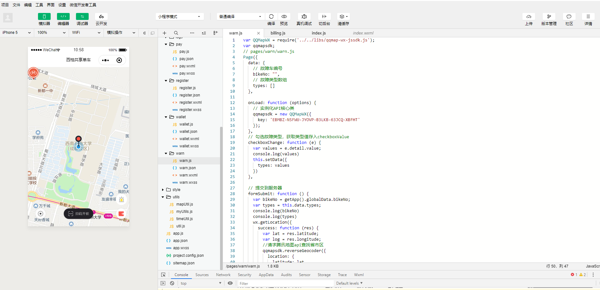

# Project-bikes

shared bicycle project 
共享单车项目

### 技术选型:

|/|微信小程序开发技术|
|----|----|
|1|springboot后台管理|
|2|mysql集群|
|3|mongodb集群|
|4|redis集群|
|5|Elasticsearch实时查询|
|6|spark(core,sql,streaming)|
|7|Nginx负载均衡|

### 项目目录:
* 前端-微信小程序: Project-bikes/weixinbike  
* 后台管理-springboot: Project-bikes/bike 

### 项目运行环境:
* 后台运行在IDE IntelliJ IDEA中，因为springboot工程是一个maven工程，通过加载Project-bikes/bike/pom.xml文件在IDE IntelliJ即可搭建好运行环境。shared bicycle project 采用java版本为jdk1.8。

* 前端为微信小程序，安装微信小程序开发工具导入所有文件Project-bikes/weixinbike即可运行。其中js发送相关请求，如想elasticsearch查询存储车辆数目，初始化为0；用户注册信息，用户数量，车辆数目，地理位置，均保存在mysql集群，mongodb集群，以及redis集群中，需要修改后台程序配置文件里集群的配置，url地址，才能顺利运行整个项目。  

