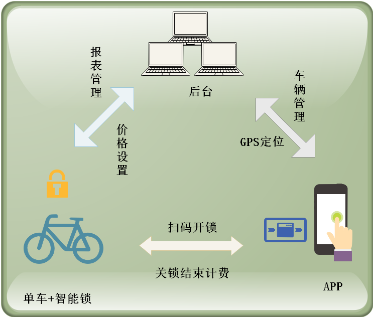
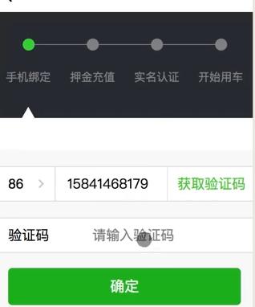
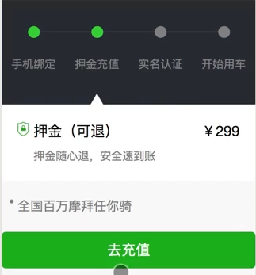
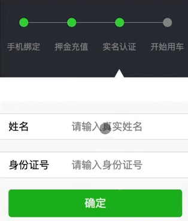
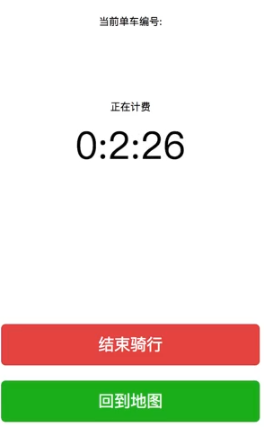

### projectNote



### 项目流程:

用户使用app扫码开锁，触发id:3，

```javascript
 {
            //扫码按钮
            id: 3,
            iconPath: '/image/qrcode.png',
            position: {
              width: 100,
              height: 40,
              left: width / 2 - 50,
              top: height - 60.
            }
```
---

触发3后会进行状态status(全局变量)判断


```javascript
controltap(e) {
    var that = this;
    if (e.controlId == 3) {
      //获取全局变量中的status属性值
      var status = getApp().globalData.status;
      if (status == 0) {
        //跳转到注册页面
        wx.navigateTo({
          url: '../register/register',
        });
      } else if (status == 1) {
        wx.navigateTo({
          url: '../deposit/deposit',
        });
      } else if (status == 2) {
        wx.navigateTo({
          url: '../identify/identify',
        });
      } else if (status == 3) {
        scanCode()
      }
    }

    if (e.controlId == 4) {
      console.log("123")
      wx.navigateTo({
        url: '../pay/pay',
      })
    }

    if (e.controlId == 5) {
      that.mapCtx.getCenterLocation({
        success: function (res) {
          var lat = res.latitude;
          var log = res.longitude;
          var bikeNo =  getApp().globalData.bikeNo;
          wx.request({
            url: "http://localhost:8888/bike0",
            method: 'POST',
            data: {
              id :bikeNo,
              location: [log,lat]
            },
            success: function () {
              getApp().globalData.bikeNo = bikeNo+ 1
              findBikes(that, log, lat)
            }
          })
        }
      })
    }
```

---
如果状态为0会跳转到注册页面。
注册页面会向服务器发送请求。

```javascript
#注册页面
genVerifyCode: function () {
    var index = this.data.countryCodeIndex;
    var countryCode = this.data.countryCodes[index];
    var phoneNum = this.data.phoneNum;
    //console.log(code + " ," + phoneNum) 
    wx.request({
      //小程序访问的网络请求协议必须是https，url里面不能有端口号
      url: "http://localhost:8888/genCode",
      header: { 'content-type': 'application/x-www-form-urlencoded' },
      data: {
        nationCode: countryCode,
        phoneNum: phoneNum
      },
      method: 'POST',
      success: function () {
        wx.showToast({
          title: '验证码已发送',
          icon: 'success'
        })
      }
    })
})
```
---

服务器接到请求会调用生成验证码方法genVerifyCode,获得app传过来的地理位置以及电话号码。此时调用腾讯短信服务接口，导入jar包，申请开通免费短信验证码服务，获取appkey，appid，将其存入redis，生成code返回给app，并将电话，code存入reids等待对方收到验证码再发回来时核对。




```java
public void genVerifyCode(String nationCode, String phoneNum) throws Exception {
        String appkey = stringRedisTemplate.opsForValue().get("appkey");
        //redisTemplate.
        //调用腾讯云的短信接口（短信的appid， 短信的appkey）
       SmsSingleSender singleSender = new SmsSingleSender(1400047183, appkey);
        //普通单发
        String code = "8888";
        String code =  (123) + "";
        //调用发送短信功能
      	singleSender.send(0, nationCode, phoneNum, "您的登录验证码为" + code, "", "");
        //将数据保存到redis中，redis的key手机号，value是验证码，有效时长120秒
        stringRedisTemplate.opsForValue().set(phoneNum, code, 120, TimeUnit.DAYS);
    }
```


---
当用户收到验证码后，用户需要填写验证码，发送给服务器verfiy方法，并将status状态改为1，
服务器收到请求后，会根据相应的电话号码从redis里调出保存好的验证码进行核对，如果成功，跳转到deposit充值页面。再访问register，服务器会将信息存入mogodb保存起来。

```javascript
 formSubmit: function (e) {
    console.log(e)
    var phoneNum = e.detail.value.phoneNum
    var verifyCode = e.detail.value.verifyCode
    var openid = getApp().globalData.openid
    console.log(openid);
    wx.request({
      url: "http://localhost:8888/verify",
      header: { 'content-type': 'application/x-www-form-urlencoded' },
      data: {
        phoneNum: phoneNum,
        verifyCode: verifyCode,
        status: 1,
        id: openid
      },
      method: "POST",
      success: function (res) {
        console.log(res);
        if (res.data) {
          wx.request({
            //微信小程序成产环境请求的协议必须是https，地址必须是域名，不能带端口号
            url: "http://localhost:8888/register",
            data: e.detail.value,
            method: 'POST',
            success: function (res) {
              var globalData = getApp().globalData
              globalData.phoneNum = phoneNum
              wx.navigateTo({
                url: '../deposit/deposit'
              })
            }
          })
        } else {
          wx.showModal({
            title: '提示',
            content: '您输入的验证码有误，请重新输入！',
            showCancel: false
          })
        }
      }
    })
  }
})
```



---
```java
//verfiy验证方法
 public boolean verify(User user) {
        boolean flag = false;
        String phoneNum = user.getPhoneNum();
        String verifyCode = user.getVerifyCode();
        String code = stringRedisTemplate.opsForValue().get(phoneNum);
        if(verifyCode != null && verifyCode.equals(code)) {
            mongoTemplate.save(user);
            flag = true;
        }
        return flag;
    }
```

---

当用户进入押金充值页面，会向服务器deposit发送请求，默认充值299；

```javascript
#充值页面
deposit: function () {
    var that = this;
    wx.showModal({
      title: '提示',
      content: '是否要充值押金？',
      confirmText: '确认',
      success: function (res) {
        //模拟加载的动画
        wx.showLoading({
          title: '充值中...',
        })
        var phoneNum = getApp().globalData.phoneNum;
        wx.request({
          url: "http://localhost:8888/deposit",
          header: { 'content-type': 'application/x-www-form-urlencoded' },
          data: {
            phoneNum: phoneNum,
            deposit: 299,
            status: 2
          },
          method: 'POST',
          success: function (res) {
            wx.hideLoading();
            wx.navigateTo({
              url: '../identify/identify',
            });
          }
        })
```
---



```java
//后台deposit方法
public void deposit(User user) {
        mongoTemplate.updateFirst(new Query(Criteria.where("phoneNum").is(user.getPhoneNum())), new Update().set("status", user.getStatus()).set("deposit", 299),  User.class);
    }
```

服务器接受到请求后，会通过deposit方法，将电话，状态，充值金额存入mongodb。成功以后将状态改为2，并跳转到identify页面。在identify页面中，会向服务器发送请求，调用identify方法，修改mongodb里存储的字段，改status状态为3.

```javascript
formSubmit: function (e) {
    //获取全局变量的数据
    var globalData = getApp().globalData;
    var phoneNum = globalData.phoneNum;
    var name = e.detail.value.name
    var idNum = e.detail.value.idNum
    wx.request({
      url: "http://localhost:8888/identify",
      header: { 'content-type': 'application/x-www-form-urlencoded' },
      data: {
        phoneNum: phoneNum,
        name: name,
        idNum: idNum,
        status: 3
      },
      method: 'POST',
      success: function (res) {
        wx.hideLoading();
        //更新全局变量中的status属性
        globalData.status = 3
        wx.navigateTo({
          url: '../index/index',
        });
      }
    })
  }
})
```
---
```java
public void identify(User user) {
        mongoTemplate.updateFirst(new Query(Criteria.where("phoneNum").is(user.getPhoneNum())), new Update().set("status", user.getStatus()).set("name", user.getName()).set("idNum", user.getIdNum()),  User.class);

    }
```

在成功完成identify以后，页面跳转到index页面，当状态为3，调用扫码开锁方法，成功以后直接跳转到支付页面。

```javascript
function scanCode() {
  wx.scanCode({
    success: function (res) {
      var bikeNo = res.result;
      console.log(bikeNo);
      /**
      var openid = wx.getStorageSync('openid');
      
      qqmapsdk.reverseGeocoder({
        location: {
          latitude: that.data.lat,
          longitude: that.data.log
        },
        success: function (res) {
          var addr = res.result.address_component
          var province = addr.province;
          var city = addr.city;
          var district = addr.district;
          //将数据写入到es中
          
        }
      });
       */
      wx.navigateTo({
        url: '../billing/billing'
      });
    }
  })
}
```
---

```javascript
Page({
  data: {
    hours: 0,
    minuters: 0,
    seconds: 0,
    billing: "正在计费"
  },
  // 页面加载
  onLoad: function (options) {
    console.log(options.number);
    //改变单车的状态
    var params = {
      url: 'bike/status',
      method: 'post',
      data: {
        id: options.number
      }
    };
    wx.setStorageSync('time', true);
    // 获取车牌号，设置定时器
    this.setData({
      number: options.number,
      timer: this.timer
    })
    // 初始化计时器
    let s = 0;
    let m = 0;
    let h = 0;

    //获取开始的时间

    var tmp = Date.parse(new Date()).toString();
    getApp().globalData.ftime = tmp;
    tmp = tmp.substr(0, 10);
    wx.setStorageSync('start_time', tmp);
    // 计时开始
    this.timer = setInterval(() => {
      this.setData({
        seconds: s++
      })
      if (s == 60) {
        s = 0;
        m++;
        setTimeout(() => {
          this.setData({
            minuters: m
          });
        }, 1000)
        if (m == 60) {
          m = 0;
          h++
          setTimeout(() => {
            this.setData({
              hours: h
            });
          }, 1000)
        }
      };
    }, 1000)
  },
  // 结束骑行，清除定时器
  endRide: function () {
    //结束时间
    var tmp = Date.parse(new Date()).toString();
    getApp().globalData.ltime = tmp;
    tmp = tmp.substr(0, 10);
    wx.setStorageSync('end_time', tmp);
    //结束位置
    // 2.获取并设置当前位置经纬度
    wx.getLocation({
      type: "gcj02",
      success: (res) => {
    
        console.log(res);
        wx.setStorageSync('end_long', res.longitude);
        wx.setStorageSync('end_lati', res.latitude);
      }
    });
    var times = (this.data.minuters * 60 + this.data.hours * 3600 + this.data.seconds);
    wx.setStorageSync('time', false)
    clearInterval(this.timer);
    this.timer = "";
    this.setData({
      billing: "本次骑行耗时",
      disabled: true
    });
    wx.request({
      url: "http://192.168.9.12/kafka/ride",
      method: "POST",
      data: {
        times: times,
        lat: wx.getStorageSync('end_long'),
        log: wx.getStorageSync('end_lati'),
        ftime: wx.getStorageSync('start_time'),
        ltime: wx.getStorageSync('end_time')
      },
      method: "POST",
      success: function () {
      }
    })
    /**
    setTimeout(()=>{
      wx.navigateTo({
        url: '../pay/pay'
      });
    },2000);
    */
  }
})
```



在支付页面，开启骑车计时模式，以及获取当前经纬度。当骑车停止，向kafka发送地理位置以及骑车时长。

