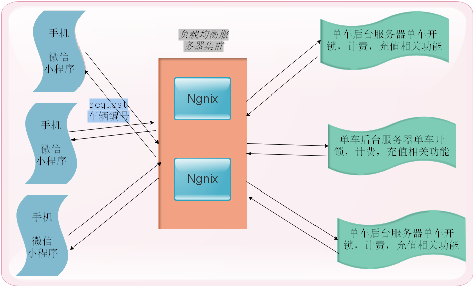
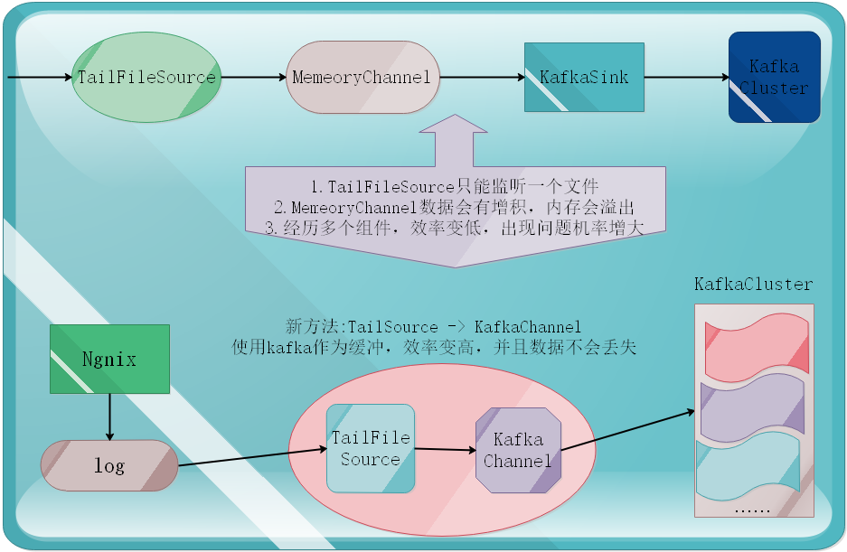

### projectNote1

系统web架构:  

 
 
 关于mongodb的使用:  
1.使用javaapi（spring-data）向mongo中存储数据  
2.使用javaapi（spring-data）从mongo中读取输入，然后显示在微信小程序的地图页面上  
3.后台web系统从mongo中读取数据，然后显示到页面列表中  
4.在微信小程序的重要事件中埋点（openid），然后将行为信息保存到mongo中  
5.使用spark分析mongo中的数据（RDD和SQL）  

mongodba安装:

```bash
ongdb一个NoSQL数据库，里面存储的是BSON（Binary Serialized Document Format，支持集群，高可用、可扩展。

mongdb中的一些概念
  MongoDB        MySQL
  database       database
  collection     table
  json       二维表
  不支持SQL     SQL
  _id          主键

-----------------------------------------------------------------------------------------------
-----------------------------------------------------------------------------------------------

#创建一个普通用户xiaoniu
useradd xiaoniu
#为hadoop用户添加密码：
echo 123456 | passwd --stdin xiaoniu
#将bigdata添加到sudoers
echo "xiaoniu ALL = (root) NOPASSWD:ALL" | tee /etc/sudoers.d/xiaoniu
chmod 0440 /etc/sudoers.d/xiaoniu
#解决sudo: sorry, you must have a tty to run sudo问题，在/etc/sudoer注释掉 Default requiretty 一行
sudo sed -i 's/Defaults    requiretty/Defaults:xiaoniu !requiretty/' /etc/sudoers

#配置mongo的yum源
sodu vi /etc/yum.repos.d/mongodb-org-3.4.repo

[mongodb-org-3.4]
name=MongoDB Repository
baseurl=https://repo.mongodb.org/yum/redhat/\$releasever/mongodb-org/3.4/x86_64/
gpgcheck=1
enabled=1
gpgkey=https://www.mongodb.org/static/pgp/server-3.4.asc

#关闭selinux
vi /etc/sysconfig/selinux 
SELINUX=disabled

#重新启动
reboot

------------------------------------------------------------------------------------------------
###mongo的安装和基本使用###
------------------------------------------------------------------------------------------------
#在机器上使用xiaoniu用户登录（本地安装给你了rpm包，rpm -ivh *.rpm）
sudo yum install -y mongodb-org

#修改mongo的配置文件
sudo vi /etc/mongod.conf 

#注释掉bindIp或者修改成当前机器的某一个ip地址

#启动mongo
sudo service mongod start

#连接到mongo
#如果注释掉了bindIp，那么连接时用
mongo
#指定了ip地址
mongo --host 192.168.100.101 --port 27017

#使用或创建database
use xiaoniu

#创建集合（表）
db.createCollection("bike")

#插入数据
db.bike.insert({"_id": 100001, "status": 1, "desc": "test"})
db.bike.insert({"_id": 100002, "status": 1, "desc": "test"})

#查找数据(所有)
db.bine.find()

#退出
exit

#关闭mongo服务
sudu service mongod stop

#设置服务开机启动
sudo checkconfig mongod on

#设置mongo服务开机不启动
sudo chkconfig mongod off

------------------------------------------------------------------------------------------------
###mongo安全认证配置###
#如果修改了mongo存储是的目录那么一定要修改该目录的所属用户和组为mongod
#chown -R mongod:mongod  /mongo/
------------------------------------------------------------------------------------------------
#添加管理员用户
#使用admin这个database
use admin

#在没有开启认证的情况下，创建一个超级用户
db.createUser(
     {
       user: "laozhao",
       pwd: "laozhao123",
       roles: [ {role: "root", db: "admin" }]
     }
)

#修改mongo的配置文件/etc/mongod.conf，配置mongo的安全认证
security:
  authorization: enabled

#重启mongo服务
service mongod restart


#重新使用mongo shell连接
mongo

#使用admin database
use admin

#授权登录
db.auth("admin", "admin123")

#创建一个bike数据库
use bike

#添加一个普通用户，具备读写权限
db.createUser(
     {
       user: "xiaoniu",
       pwd: "123568",
       roles: ["readWrite"]
     }
)

#使用小牛用户登录
mongo
use bike
db.auth("xiaoniu", "123568")

#在database下创建collection
db.createCollection("users")
db.createCollection("bikes")

#插入数据
db.users.insert( { name: "laozhao", age: 30 } )

#查找
db.users.find()

db.users.update({'name':'laozhao'},{$set:{'age': 18}},{multi:true})

db.users.remove({'name': 'laoduan'})
db.users.remove({'name': 'laoduan'}, 1)

db.users.find({"name":"laoduan", "fv": 99.99})


#查看当前db的索引
db.logs.getIndexes()

#创建索引
db.logs.ensureIndex({"name":1})

#删除索引
db.logs.dropIndex({"name":1})


#开启运行用户从其他机器连接mongodb
#不然会报错Caused by: java.net.ConnectException: Connection refused (Connection refused)
#修改/etc/mongod.conf，注释掉bindIp:
#  bindIp:

#重启mongodb
service mongod restart


数据库用户角色：read、readWrite;
数据库管理角色：dbAdmin、dbOwner、userAdmin；
集群管理角色：clusterAdmin、clusterManager、clusterMonitor、hostManager；
备份恢复角色：backup、restore；
所有数据库角色：readAnyDatabase、readWriteAnyDatabase、userAdminAnyDatabase、dbAdminAnyDatabase
超级用户角色：root
// 这里还有几个角色间接或直接提供了系统超级用户的访问（dbOwner 、userAdmin、userAdminAnyDatabase）
内部角色：__system
```

ngnix安装:

```bash
1.上传nginx安装包
2.解压nginx
	tar -zxvf nginx-1.12.2.tar.gz -C /usr/local/src/
3.进入到nginx的源码目录
	cd /usr/local/src/nginx-1.12.2/
4.预编译
	./configure
5.安静gcc编译器
	yum -y install gcc pcre-devel openssl openssl-devel
6.然后再执行
	./configure
7.编译安装nginx
	make && make install
8.启动nginx
	sbin/nginx
9.查看nginx进程
	ps -ef | grep nginx
	netstat -anpt | grep nginx


--------------------------------------------------------------------------

将springboot程序部署在多台服务器上，然后启动springboot
java -jar niubike-0.0.1-SNAPSHOT.war >> ./logs 2>&1 &

--------------------------------------------------------------------------

修改nginx的配置文件，让nginx实现负载均衡功能
vi /usr/local/nginx/conf/nginx.conf
```

vi /usr/local/nginx/conf/nginx.conf如下:

```bash
#user  nobody;
worker_processes  1;

#error_log  logs/error.log;
#error_log  logs/error.log  notice;
#error_log  logs/error.log  info;

#pid        logs/nginx.pid;


events {
    worker_connections  1024;
}


http {
    include       mime.types;
    default_type  application/octet-stream;

    #log_format  main  '$remote_addr - $remote_user [$time_local] "$request" '
    #                  '$status $body_bytes_sent "$http_referer" '
    #                  '"$http_user_agent" "$http_x_forwarded_for"';

    #access_log  logs/access.log  main;

    sendfile        on;
    #tcp_nopush     on;

    #keepalive_timeout  0;
    keepalive_timeout  65;

    #gzip  on;

    #响应数据的来源
    upstream tomcats { 
        server node-1.xiaoniu.com:8888 weight=1;
        server node-2.xiaoniu.com:8888 weight=1;
        server node-3.xiaoniu.com:8888 weight=1;
    }

    server {
        listen       80;
        server_name  node-5.xiaoniu.com;
	
        location ~ .* {
    	    proxy_pass http://tomcats;
	}

    }

}
```

ngnix整合kafka:

```bash
安装nginx-kafka插件

1.安装git
	yum install -y git
2.切换到/usr/local/src目录，然后将kafka的c客户端源码clone到本地
	cd /usr/local/src
	git clone https://github.com/edenhill/librdkafka
3.进入到librdkafka，然后进行编译
	cd librdkafka
	yum install -y gcc gcc-c++ pcre-devel zlib-devel
	./configure
	make && make install

4.安装nginx整合kafka的插件，进入到/usr/local/src，clone nginx整合kafka的源码
	cd /usr/local/src
	git clone https://github.com/brg-liuwei/ngx_kafka_module

5.进入到nginx的源码包目录下	（编译nginx，然后将将插件同时编译）
	cd /usr/local/src/nginx-1.12.2
	./configure --add-module=/usr/local/src/ngx_kafka_module/
	make
	make install

6.修改nginx的配置文件，详情请查看当前目录的nginx.conf

7.启动zk和kafka集群(创建topic)
	/bigdata/zookeeper-3.4.9/bin/zkServer.sh start
	/bigdata/kafka_2.11-0.10.2.1/bin/kafka-server-start.sh -daemon /bigdata/kafka_2.11-0.10.2.1/config/server.properties

8.启动nginx，报错，找不到kafka.so.1的文件
	error while loading shared libraries: librdkafka.so.1: cannot open shared object file: No such file or directory
9.加载so库
	echo "/usr/local/lib" >> /etc/ld.so.conf
	ldconfig
```


修改nginx的配置文件

```bash

#user  nobody;
worker_processes  1;

#error_log  logs/error.log;
#error_log  logs/error.log  notice;
#error_log  logs/error.log  info;

#pid        logs/nginx.pid;


events {
    worker_connections  1024;
}


http {
    include       mime.types;
    default_type  application/octet-stream;

    #log_format  main  '$remote_addr - $remote_user [$time_local] "$request" '
    #                  '$status $body_bytes_sent "$http_referer" '
    #                  '"$http_user_agent" "$http_x_forwarded_for"';
    #access_log  logs/access.log  main;
    sendfile        on;
    #tcp_nopush     on;
    #keepalive_timeout  0;
    keepalive_timeout  65;
    #gzip  on;
    
    kafka;
    kafka_broker_list node-1.xiaoniu.com:9092 node-2.xiaoniu.com:9092 node-3.xiaoniu.com:9092; 	
    
    server {
        listen       80;
        server_name  node-6.xiaoniu.com;
        #charset koi8-r;
        #access_log  logs/host.access.log  main;

    	location = /kafka/track {
                kafka_topic track;
        }

    	location = /kafka/user {
                kafka_topic user;
        }

        #error_page  404              /404.html;

        # redirect server error pages to the static page /50x.html
        #
        error_page   500 502 503 504  /50x.html;
        location = /50x.html {
            root   html;
        }

    }

}
```

Nginx (engine x) 是一个高性能的HTTP和反向代理web服务器，同时也提供了IMAP/POP3/SMTP服务。Nginx是由伊戈尔·赛索耶夫为俄罗斯访问量第二的Rambler.ru站点（俄文：Рамблер）开发的，第一个公开版本0.1.0发布于2004年10月4日。  
其将源代码以类BSD许可证的形式发布，因它的稳定性、丰富的功能集、示例配置文件和低系统资源的消耗而闻名。2011年6月1日，nginx 1.0.4发布。  
Nginx是一款轻量级的Web 服务器/反向代理服务器及电子邮件（IMAP/POP3）代理服务器，在BSD-like 协议下发行。其特点是占有内存少，并发能力强，事实上nginx的并发能力确实在同类型的网页服务器中表现较好，中国大陆使用nginx网站用户有：百度、京东、新浪、网易、腾讯、淘宝等。Nginx作为负载均衡服务：Nginx 既可以在内部直接支持 Rails 和 PHP 程序对外进行服务，也可以支持作为 HTTP代理服务对外进行服务。Nginx采用C进行编写，不论是系统资源开销还是CPU使用效率都比 Perlbal 要好很多。
处理静态文件，索引文件以及自动索引;打开文件描述符缓冲。   
无缓存的反向代理加速，简单的负载均衡和容错。  
FastCGI，简单的负载均衡和容错。  
模块化的结构。包括 gzipping, byte ranges, chunked responses,以及 SSI-filter 等 filter。如果由 FastCG或其它代理服务器处理单页中存在的多个 SSI，则这项处理可以并行运行，而不需要相互等待。

---

flume采集日志:
自定义偏移量，创建一个java类，定义读取记录偏移量，打包导入flume lib中。并建立一个java类决定读取的数据以什么形式保存。conf文件如下:
```bash
#bin/flume-ng agent -n a0 -f conf/a0.conf -c conf -Dflume.root.logger=INFO,console
#定义agent名， source、channel、sink的名称
a0.sources = r1
a0.channels = c1

#具体定义source
a0.sources.r1.type = cn.edu360.flume.source.Source2File
a0.sources.r1.filePath = /root/log/access.txt
a0.sources.r1.posiFile = /root/log/posi.txt
a0.sources.r1.interval = 2000
a0.sources.r1.charset = UTF-8

a0.sources.r1.interceptors = i1
a0.sources.r1.interceptors.i1.type = cn.edu360.yy.JsonInterceptor$Builer
a0.sources.r1.interceptors.i1.fields = id,name,fv,age
a0.sources.r1.interceptors.i1.separator = ,
```

当需要将flume采集的数据写入Kafka时，由于传统tailfilesource只能监听一个文件，内存容易溢出，导致数据丢失，并且组件过多，效率低下。所以采用kafka同时作为channel与sink组件，提高效率。



flume -> kafka -> hdfs,conf文件如下:

```bash
#
1.在一台机器上安装jdk
2.解压flume-ng
3.创建flume的配置文件kafka-hdfs.conf
4.添加flume依赖hdfs的jar包
5.将hdfs的配置文件放入到flume的conf目录下（core-site.xml,hdfs-site.xml）
6.启动flume
#
#
#定义agent名和channel、sink的名称
a1.channels = c1
a1.sinks = k1

#定义kafka-channel
a1.channels.c1.type = org.apache.flume.channel.kafka.KafkaChannel
a1.channels.c1.parseAsFlumeEvent = false
a1.channels.c1.kafka.bootstrap.servers = node-1:9092,node-2:9092,node-3:9092
a1.channels.c1.kafka.topic = gamelog
a1.channels.c1.kafka.consumer.group.id = g100

#具体定义sink
a1.sinks.k1.type = hdfs
a1.sinks.k1.hdfs.path = hdfs://ns1/gamelog/%Y%m%d
a1.sinks.k1.hdfs.useLocalTimeStamp = true
a1.sinks.k1.hdfs.filePrefix = log-
a1.sinks.k1.hdfs.fileType = DataStream
#不按照条数生成文件
a1.sinks.k1.hdfs.rollCount = 0
#HDFS上的文件达到128M时生成一个文件
a1.sinks.k1.hdfs.rollSize = 134217728
#HDFS上的文件达到60秒生成一个文件
a1.sinks.k1.hdfs.rollInterval = 60

a1.sinks.k1.channel = c1
```


